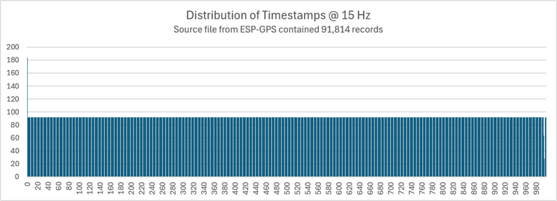

## Logging Rate

### Introduction

- 10 Hz is twice as accurate as 5 Hz, right?
  - Not necessarily... 10 Hz may be worse than 5 Hz
  - Static test shows otherwise
  - C:\Users\mwgeo\OneDrive\Documents\GPS Files\Testing\2024\2024-06-18, Frequency Test - Garden 1
    - 10 Hz worse than 5 due to 2 systems and lower HDOP
    - sAcc is lying and so is +/-
- 20 Hz and 25 Hz unlikely to offer any benefits
  - Only 1 or 2 systems, so similar considerations to 5 Hz vs 10 Hz
    - 2 systems @ 20 Hz may be no better than 3 or 4 systems at 5 Hz
    - 1 systems @ 25 Hz likely to be worse than 3 or 4 systems at 5 Hz
  - Requires more compute power and storage

### Max Rates

The [MAX-M10M-00B Data sheet](https://content.u-blox.com/sites/default/files/documents/MAX-M10M-00B_DataSheet_UBX-22028884.pdf) shows the max update rate of the several possible configurations:

| Constellations / Services                   | Default | High Performance |
| ------------------------------------------- | ------- | ---------------- |
| GPS / GLONASS / BDS B1I / GALILEO / BDS B1C | 18 Hz   | 25 Hz            |
| GPS+GAL (default)                           | 10 Hz   | 20 Hz            |
| GPS+GAL+BDS B1C                             | 8 Hz    | 16 Hz            |
| GPS+GAL+GLO                                 | 6 Hz    | 16 Hz            |
| GPS+GAL+BDS B1I                             | 3 Hz    | 12 Hz            |
| GPS+GAL+BDS B1C+GLO                         | 4 Hz    | 10 Hz            |

n.b. These figures are all on the basis of a minimum 98% fix rate under typical conditions.

The configuration required to support the higher logging rates is described on another page - see [Higher Logging Rates](../performance/high-rates.md).

### Configuration

The [u-blox M10 SPG 5.30 Interface description](https://content.u-blox.com/sites/default/files/documents/u-blox-M10-SPG-5.30_InterfaceDescription_UBXDOC-304424225-20395.pdf) describes how to configure the navigation update rate.

- `CFG-RATE-MEAS` = Nominal time between GNSS measurements

- `CFG-RATE-NAV` = Ratio of number of measurements to number of navigation solutions

- `CFG-RATE-TIMEREF` = Time system to which measurements are aligned

The default time reference system is GPS, but the milliseconds should be identical to UTC.

#### Popular Update Rates

Popular update rates include the following:

| Rate  | CFG-RATE-MEAS | CFG-RATE-NAV |
| :---: | :-----------: | :----------: |
| 1 Hz  |     1000      |      1       |
| 2 Hz  |      500      |      1       |
| 5 Hz  |      200      |      1       |
| 10 Hz |      100      |      1       |
| 20 Hz |      50       |      1       |

4 Hz, 8 Hz and 25 Hz may also have use cases, because they are all divisors of 1000.

#### Unusual Update Rates

It is worth mentioning the MAX M10 data sheet also refers to update rates that are not divisors of 1000:

| Rate  | CFG-RATE-MEAS | CFG-RATE-NAV |
| :---: | :-----------: | :----------: |
| 3 Hz  |      334      |      1       |
| 6 Hz  |      167      |      1       |
| 12 Hz |      84       |      1       |
| 16 Hz |      63       |      1       |
| 18 Hz |      56       |      1       |

I suspect that u-blox only chose these update rates to illustrate what the MAX M10 is capable of achieving 98% of the time.

#### Implications of Non-Divisors

When `CFG-RATE-MEAS` is not a divisor of 1000 the timestamps are inconsistent from one second to the next.

This example uses 15 Hz data from an ESP-GPS. Intriguingly .995 and  .996 are rare in the file, seemingly being logged at .000.

I am not a fan of unsual update rates, and prefer timestamps that are consistent from one second to the next.

- 0.000, 0.100, 0.200, etc.

Regular timestamps are easier to read, and non-divisors can cause some complications for speed analysis software.

### Existing Devices

Some existing devices using the M10 support the following logging rates.

|      | Motion | ESP-GPS | LISA GPS |
| :--: | :----: | :-----: | :------: |
|  1   |   ✅    |    ✅    |    ✅     |
|  2   |   ✅    |    ✅    |    ✅     |
|  4   |   -    |    ✅    |    ✅     |
|  5   |   ✅    |    ✅    |    ✅     |
|  8   |   -    |    ✅    |    ✅     |
|  10  |   ✅    |    ✅    |    ✅     |
|  15  |   -    |    ✅    |    -     |
|  20  |   -    |    ✅    |    -     |

n.b. The SYRAC-GPS (which is an ESP-GPS) also mentions 3 and 6 Hz in the user guide, presumably inspired by u-blox data sheets.

### Observations

#### Accuracy

Previous testing has demonstrated that 3 systems @ 5 Hz perform better than 2 systems @ 10 Hz.

Not only did 10 Hz logging perform worse than 5 Hz but analysis software says the results are better!

This is fully documented on a separate page describing [static testing](../testing/static-5hz-10hz.md).

#### Aliasing

It should be noted that it is possible to request 1 Hz output in numerous ways, but it is not clear whether it impacts the Kalman filter.

| Rate | CFG-RATE-MEAS | CFG-RATE-NAV |
| :--: | :-----------: | :----------: |
| 1 Hz |      100      |      10      |
| 1 Hz |      200      |      5       |
| 1 Hz |      500      |      2       |
| 1 Hz |     1000      |      1       |

I wrote an [article](https://logiqx.github.io/gps-details/general/aliasing/) about the effects of aliasing and how it is evident in 1 Hz u-blox data. I wonder whether different combinations of `CFG-RATE-MEAS` and `CFG-RATE-NAV` might cause the M10 to implement a low-pass filter (LPF).

I was once told that it may also be possible to use the u-blox LPF by computing the resultant vector of the North and East velocity fields, instead of using the ground speed field. I have not had an opportunity to investigate this yet.

### Troubleshooting

Setting `CFG-RATE-MEAS` to a value that is not a divisors of 1000 has been discussed, and will result in irregular timestamps. This is somewhat cosmetic, but also has potential implications for speed analysis software.

The u-blox data sheets describe max update rates on the basis of a minimum 98% fix rate under typical conditions. Dropped points are still possible / likely and will typically occur at the top of the epoch - between .000 and .200.

The requirements for higher logging rates include clock speeds (M10 and ESP32), and baud rate. These topics are all described in detail on another page specific to [higher logging rates](../performance/high-rates.md).

