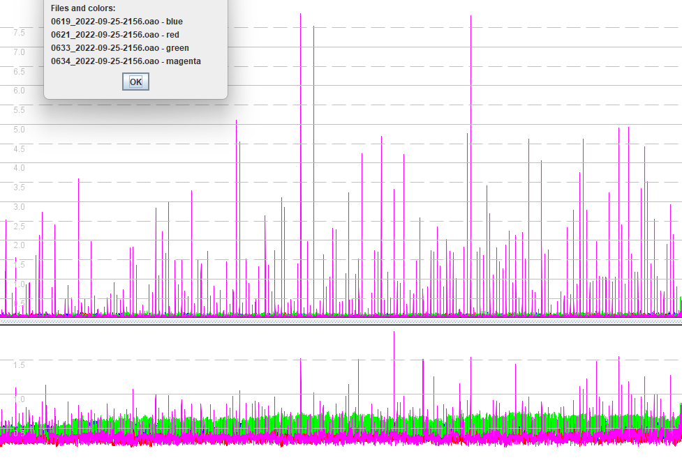
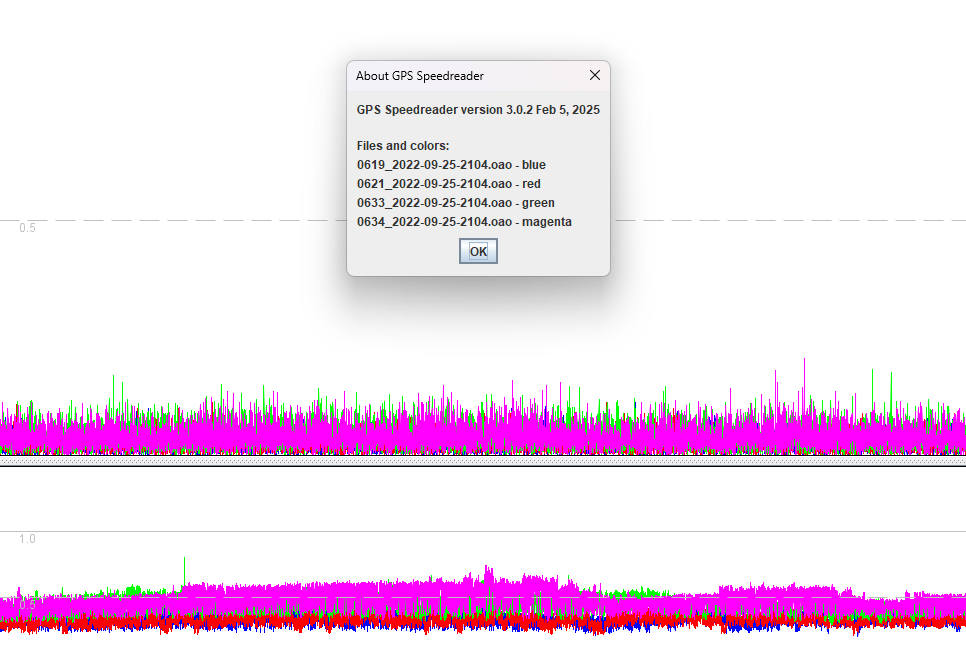

## Power Mode

### Symptoms

This page shows the difference between the "balanced" power mode (M10 default) and "full power". It is a very brief summary, because there was a lot of testing for many different units when this problem was first discovered.

In one of the earliest batches of Motion Mini devices using the M10, it was observed that a few units were behaving poorly during static testing. In this particular example, speeds from 0634 can be seen to be regularly spiking, and sAcc is also showing the presence of issues.

### Resolution

The root cause was identified and attributed to the default power mode of the M10. The firmware was updated to switch the M10 from "balanced" to "full power" and this resolved the issue. The "full power" mode has been standard in the Motion Mini since firmware 3168.

It is quite conceivable that other M10 devices could be affected by this particular issue. The root cause and the solution were were tricky to identify, because they relate to an undocumented feature of the M10. Full details of the "balanced" power mode are in the page about [signal quality](../performance/signal-quality.md).

### Note to Self

Data location, should it be needed in the future!

`C:\Users\mwgeo\OneDrive\Projects\GPS\Logs\Devices\Motion Mini (WSW)`