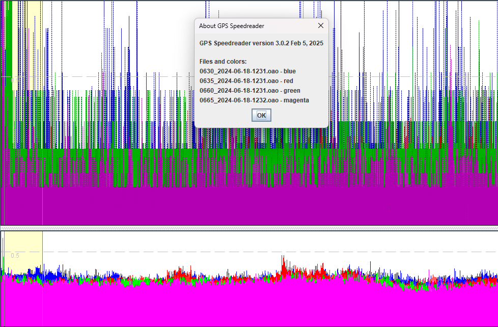
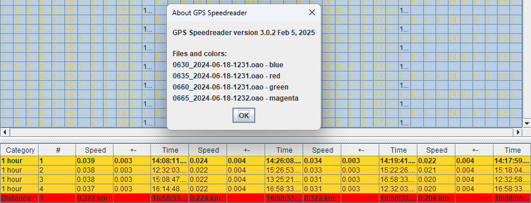
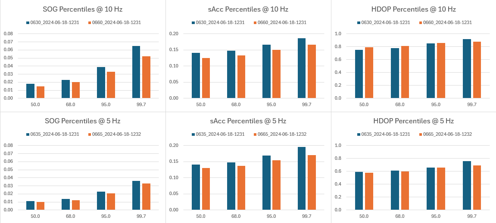

## Static Testing

### Fresh Look at 5 Hz vs 10 Hz

Motion Minis were tested in 2024 to see how the accuracy might differ for 5 Hz and 10 Hz units. The original test report can be found via this [link](https://logiqx.github.io/gps-details/devices/motion/rate/garden/), but I have re-examined the data to look for further insights.

Just as way of background, static testing works because it simulates a constant speed, exactly matching the rotation of the earth. The satellites are in [Medium Earth Orbit](https://en.wikipedia.org/wiki/Medium_Earth_orbit) (MEO), and the earth is constantly rotating, but within an [ECEF coordinate system](https://en.wikipedia.org/wiki/Earth-centered,_Earth-fixed_coordinate_system) the calculated speed should be exactly zero.

It is one of the few tests where the true speed can be known throughout the entirety of the test period. [Speed over ground](https://en.wikipedia.org/wiki/Ground_speed) (SOG) is exactly zero!

#### GPS Speedreader

The speeds from 0630 and 0660 (10 Hz units) were noticeably higher than 0635 and 0665 (5 Hz units).

Differences are also apparent in the speed results, where the 1 hour averages and distances show 0630 and 0660 (10 Hz units) travelling noticeably further than 0635 and 0665 (5 Hz units).

The 10 Hz units travelled over 0.3 km during the test, compared to the 5 Hz units that travelled around 0.2 km. These distances are based on the Doppler-derived speeds from the M10, thus showing the Doppler-derived speeds from the 10 Hz units were less accurate.

It is also worth noting that the +/- figures are falsely reporting that the speeds from the 10 Hz units were more accurate. The claimed accuracy was +/- 0.003 kts for the 10 Hz devices vs +/- 0.004 kts for the 5 Hz devices. These accuracy figures are clearly not representative of the truth.

n.b. Under normal circumstances errors will sometimes be higher than the truth, and sometimes lower. During static testing, errors are always higher than the truth (zero). This is why the hour speeds in this test are 0.02 to 0.04 kts, but the +/- figures are 0.003 to 0.004 kts.

#### Excel

The data was exported into Excel and a variety of stats were produced for SOG, sAcc and HDOP. These focused on common percentiles of interest; 50, 68, 95, and 99.7. The 100th percentile was ignored because the max values are typically freak outliers.

Summary:

- SOG was significantly lower for the 5 Hz devices, around 40 % lower than the 10 Hz devices
- sAcc was practically identical for the 5 Hz and 10 Hz devices, so not reflecting the differences
- HDOP was significantly lower for the 5 Hz devices, around 25 % lower than the 10 Hz devices

Interpretation:

- SOG was clearly better on the 5 Hz devices (3 systems, 24 sats) than 10 Hz devices (2 systems, 16 sats)
- sAcc does not necessarily reflect the true accuracy / precision of each measurement
- HDOP has a relationship with # sats and may also have a relationship with speed accuracy

### Takeaways

It is clear that the 5 Hz devices (3 constellations, 24 sats) were more accurate than 10 Hz devices (2 constellations, 16 sats).

The +/- figures from GPS Results and GPS Speedreader were misleading in this instance, because the sAcc values were similar.

- Gaussian error propagation dictates that twice as many values with the same sAcc will reduce the total error by √ 2
- This explains the +/- figures of .004 kts (5 Hz) and 0.003 kts (10 Hz), but the 5 Hz data was <u>definitely</u> more accurate

The likely cause of the differences in SOG are 3 constellations @ 5 Hz (24 sats) vs 2 constellations @ 10 Hz (16 sats).

One of the takeaways is that reducing the number of satellites to increase the logging rate <u>can</u> result in less accurate speeds.

### Note to Self

Data location, should it be needed in the future!

C:\Users\mwgeo\OneDrive\Documents\GPS Files\Testing\2024\2024-06-18, Frequency Test - Garden 1

