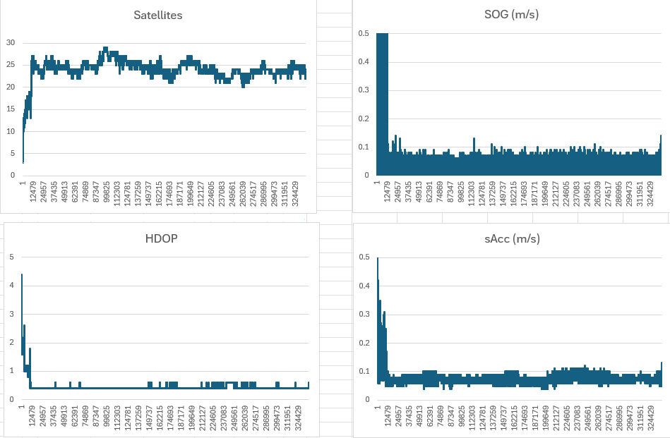
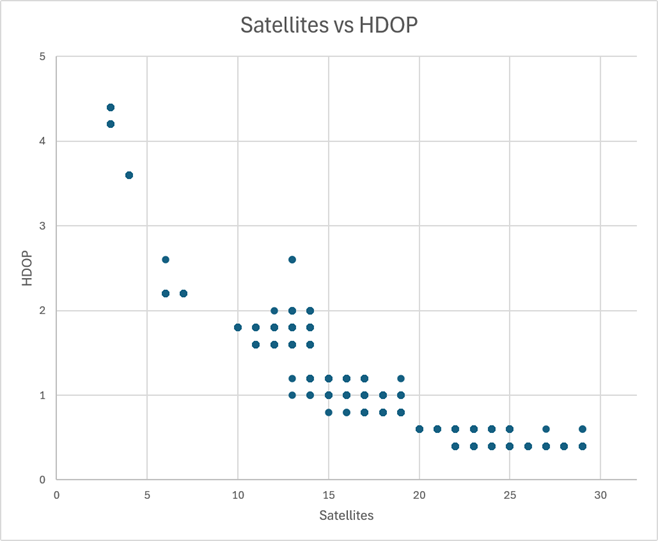

## Static ESP Testing - Accuracy and HDOP

### Overview

In principle, positional accuracy is the product of the [User Equivalent Range Error](https://courses.ems.psu.edu/geog862/node/1713) (UERE), and [Position Dilution of Precision](https://help.fieldsystems.trimble.com/tbc/2468.htm) (PDOP). Horizontal Dilution of Precision (HDOP) if the 2D equivalent of PDOP (which is 3D), and is still used by the speed sailing community.

In a nutshell, doubling HDOP will result in a doubling of horizontal positional errors for the same UERE. Similar concepts apply to speed, although that would be dependent on the User Equivalent Range Rate Error (UERRE).

Nevertheless, it should be easy to see why minimising PDOP (and HDOP) is crucial for accurate GPS measurements.

### HDOP

One way to improve [Horizontal Dilution of Precision](https://en.wikipedia.org/wiki/Dilution_of_precision) (HDOP) is to increase the number of satellites, and can be illustrated with S3__2607090003_1.

During the first 20 minutes or so the number of satellites was low, resulting in poor HDOP, SOG, and sAcc. Once the number of satellites was above 20-ish the values for HDOP, SOG, and sAcc improved dramatically.

Additional satellites will generally improve HDOP, but there is typically not much improvement beyond 25 satellites. This can be demonstrated using S3__2607090003_1, comparing HDOP with the number of satellites. It can be seen that dropping below 20 satellites is not desirable, but there are limited gains between 20 and 30 satellites.

One of the benefits of using a third GNSS is to ensure the best possible HDOP.

- 26-28 satellites appears to be the sweet spot for this particular session

However, you also need to be mindful that some satellite signals can degrade the NAV solution.

- e.g. GPS + Galileo (20 sats) can outperform GPS + Galileo + GLONASS (>25 sats)

It is important to ensure the best constellations are chosen, and low quality signals (e.g. low elevation) are discarded.

### SDOP and VSDOP

Speed Dilution of Precision (SDOP) and Vertical Speed Dilution of Precision (VSDOP) were added to the SBN and SBP formats.

It is important to understand that despite their names, neither SDOP or VSDOP are anything to do with Dilution of Precision.

They have units (m/s) and should be called something like estimated horizontal speed error, or estimated vertical speed error.

Locosys switched to the phrase "Standard Deviation of Speed" (SDOS) for the GW-60, which is an accurate name for SDOP.

### Limiting Satellites

When using 3 systems, limiting the maximum number of satellites is necessary to reduce the load on the u-blox M10.

The M10 still has to track every signal for the specified systems, but it restricts the number of satellites used in the NAV solution.

Prior to the NAV solution, the M10 must choose which signals to use in the calculations, likely based on C/N0 and optimising PDOP.

One quick way to exclude some of the more problematic signals is specify an [elevation mask](../elevation-mask/README.md) of 10o.