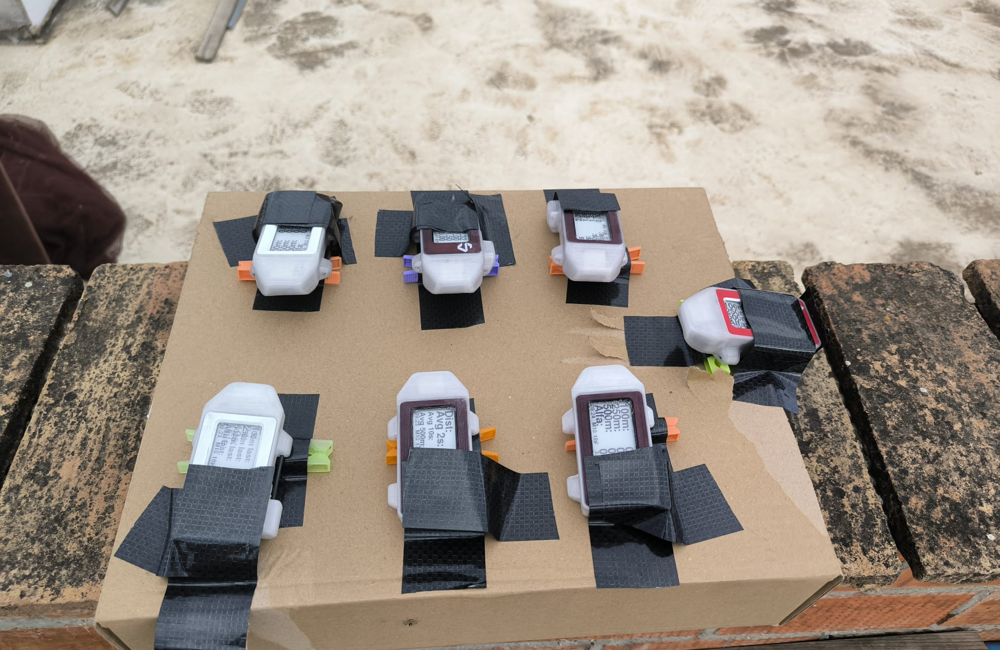
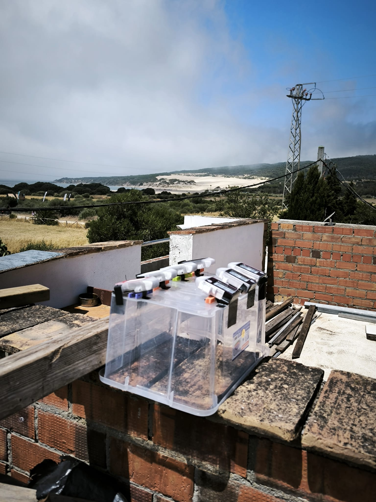

## Static ESP Testing - SYRAC Devices

The SYRAC GPS is based on the ESP GPS, and 7 of them were used during the testing.

Tests were conducted from a rooftop and the devices were arranged to ensure optimal orientation of the antennas.

Each of the SYRAC devices has a prefix corresponding to their batch:

- SY1, SY2, S3
- D1, D3, D4, D5

Subtle differences between the different devices:

- SY1, SY2, and S3 have an M10 which defaults to 38,400 baud, whereas the D devices use 115,200 baud
- S3 had a lot of excess sealant so the screen was glued to the acrylic. The screen subsequently broke due to expansion
- SY1, SY2, S3 don't have a proper ferrite, so they can get hot when charging
- C and D models have a solid support for the GPS module, and ferrite to avoid getting hot whilst charging
- D uses a double ferrite and lower voltage charger coil, resulting in safer charging
- Everything is pasted inside, and the PCB screwed

Subtle differences evident during testing:

- SY1 and SY2 did not perform as well as the D devices, when configured for 10 Hz upwards
- S3 kept changing the configuration, so it wasn't always performing the correct test
