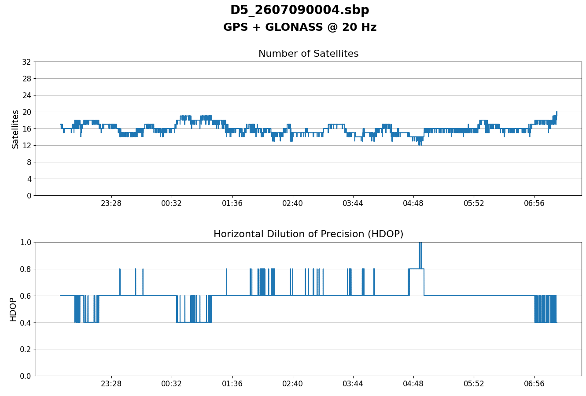
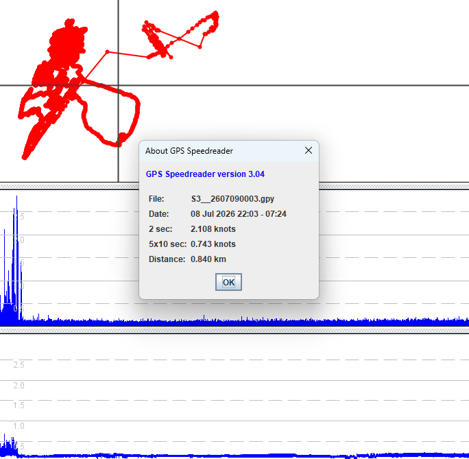
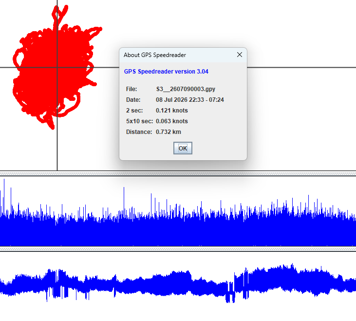
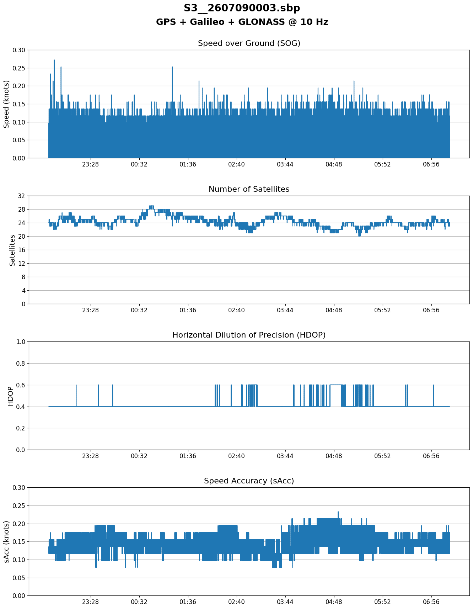

## Static ESP Testing - Test Approach

### Overview

Static testing is extremely effective because the GPS receivers essentially have a constant velocity, perfectly matching the rotation of the earth. The satellites are in [Medium Earth Orbit](https://en.wikipedia.org/wiki/Medium_Earth_orbit) (MEO) and the earth is rotating, but [Speed Over Ground](https://en.wikipedia.org/wiki/Ground_speed) (SOG) is zero within the [ECEF coordinate system](https://en.wikipedia.org/wiki/Earth-centered,_Earth-fixed_coordinate_system).

Previous tests for devices such as the Locosys GT-11, GT-31, GW-60, Motion GPS, and Garmin watches have all shown that performance during static testing is highly indicative of kinematic performance. The devices that perform best during static testing also tend to perform best on the water.

### Duration

It takes approximately 11 to 14 hours for the GNSS satellites to complete their orbits, each system being slightly different because of their altitudes.

|                      GNSS Constellation                      |     Origin     | Approx Orbital Period | Exact Sidereal Ratio | Nominal Altitude |
| :----------------------------------------------------------: | :------------: | :-------------------: | :------------------: | :--------------: |
| [GPS](https://en.wikipedia.org/wiki/Global_Positioning_System) | United States  |      11 h 58 min      |   1/2 sidereal day   |    20,180 km     |
|       [GLONASS](https://en.wikipedia.org/wiki/GLONASS)       |     Russia     |      11 h 16 min      |  8/17 sidereal day   |    19,130 km     |
| [Galileo](https://en.wikipedia.org/wiki/Galileo_(satellite_navigation_system)) | European Union |      14 h 05 min      |  10/17 sidereal day  |    23,222 km     |
|    [BeiDou](http://www.astronautix.com/b/beidou-meo.html)    |     China      |      12 h 38 min      |  9/17 sidereal day   |    21,528 km     |

The number of available satellites is constantly changing, and also dependent on which systems have been selected. The image below shows the number of GPS + GLONASS satellites in use by one of the SYRAC GPS devices during the first test, and the corresponding [Horizontal Dilution of Precision](https://en.wikipedia.org/wiki/Dilution_of_precision) (HDOP).

When comparing different GNSS configurations (especially different constellations), common practice is to run tests for 12 hours, or even 24 hours. This ensures that results (and statistics) will include a full orbit of the satellites, or even two orbits for 24 hours (night and day).

To be pragmatic, 6 hours was chosen as the minimum duration for these tests because there was not enough time for the full 12 hours. Another benefit of using 6 hours is to have enough time to pick up issues such as dropped frames and clock drift, which can be absent within 1 or 2 hours.

### Configuration

Each test includes 6 or 7 individual SYRAC GPS devices, often with slightly different GNSS configurations. TXT files from the SYRAC GPS confirm their configuration during each test, and they have been recorded in a [Google Sheet](https://docs.google.com/spreadsheets/d/1Uer4QUrVxRfGNcbAIAuh3Rk3f5fuU0N5Dms0RVw1vZA/edit?usp=sharing).

### Warm Up

Whilst a GPS receiver is acquiring a good lock on all of the satellites, accuracy will improve over time. During the first few minutes the position can be quite inaccurate, and so can the record speeds. The screenshot below shows how this affects the S3 device during the first test.

Simply removing the first 30 minutes of the data has a dramatic effect, and it is also a good idea to remove the last 5 minutes to ensure that any disturbances during the shutdown are excluded from the statistics.

### Dropped Frames

Dropped frames (aka "missing points") are undesirable in the data, especially in large quantities. Dropped frames can occur because the u-blox receiver does not have enough time to do all of the necessary processing, or because the ESP32 is not consuming it quickly enough.

There are other scenarios which I will not describe so as to not make this document too complicated. [GPS Speedreader](https://github.com/prichterich/GPS-Speedreader) was used to check the time distributions (thus identifying dropped frames), and recorded in a [Google Sheet](https://docs.google.com/spreadsheets/d/1Uer4QUrVxRfGNcbAIAuh3Rk3f5fuU0N5Dms0RVw1vZA/edit?usp=sharing). The test writeups also include all of the statistics.

### Charts

A Python script was used to create charts for each test file, ignoring the first 30 minutes and last 5 minutes.

They include Speed Over Ground (SOG), Number of Satellites, Horizontal Dilution of Precision (HDOP), and Speed Accuracy (sAcc).

### Statistics

Python was also used to produce simple statistics for each test file, ignoring the first 30 minutes and last 5 minutes. The primary focus was on Speed Over Ground (SOG); mean, median, and standard distribution.

The initial intention was to look at different percentiles, but the simpler metrics (mean, median, stddev) were ultimately selected. Max values are ignored, since they are extreme outliers and did not provide any valuable insights.

