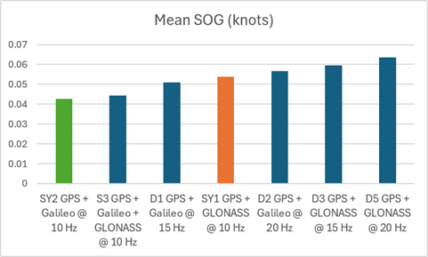
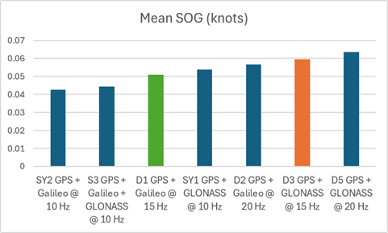
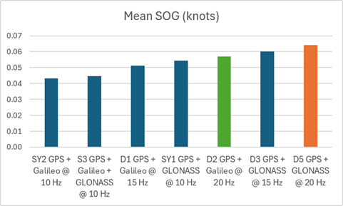
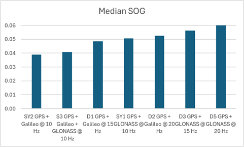
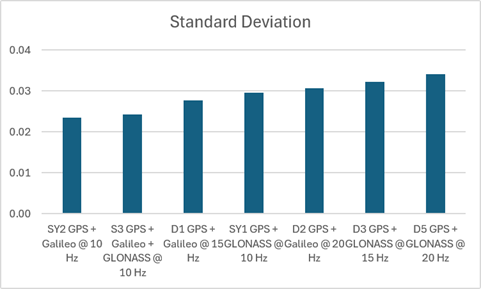

## Static ESP Testing - Phase 1

### Overview

GLONASS vs Galileo

2026-07-09 @ 0003

### Configurations

The following device configurations were tested.

|  ID  | Constellations          | Rate  | Max Sats |   ESP   | Observed time distribution (ms)       | Drops? |
| :--: | ----------------------- | :---: | :------: | :-----: | :------------------------------------ | :----: |
| SY1  | GPS + GLONASS           | 10 Hz |    32    | 160 MHz | 99: 3, 100: 336950, 101: 3            |   -    |
| SY2  | GPS + Galileo           | 10 Hz |    32    | 160 MHz | 99: 34, 100: 336334, 101: 34          |   -    |
|  D3  | GPS + GLONASS           | 15 Hz |    32    | 240 MHz | 65: 1, 66: 2280, 67: 498181, 68: 2282 |   -    |
|  D1  | GPS + Galileo           | 15 Hz |    32    | 240 MHz | 65: 1, 66: 2264, 67: 497605, 68: 2266 |   -    |
|  D5  | GPS + GLONASS           | 20 Hz |    32    | 240 MHz | 50: 672969, 51: 11, 99: 11            |   Y    |
|  D2  | GPS + Galileo           | 20 Hz |    32    | 240 MHz | 50: 673429, 51: 4, 99: 4              |   Y    |
|  S3  | GPS + Galileo + GLONASS | 10 Hz |    32    | 160 MHz | 99: 4, 100: 336891, 101: 4            |        |

Notes:

- The 20 Hz devices (D5 and D2) both dropped frames during this test, but not in huge numbers

### Statistics

The following statistics were produced by a Python script, although it needed to use an SBP file instead of GPY.

| File               | Description                  | Mean | Median | Stddev |
| ------------------- | ---------------------------------- | :---: | :----: | :----: |
| SY2\_2607090003.sbp  | GPS + Galileo @ 10 Hz          | 0.043 | 0.039  | 0.024  |
| S3\_\_2607090003.sbp  | GPS + Galileo + GLONASS @ 10 Hz | 0.044 | 0.039  | 0.025  |
| D1\_2607090003.sbp   | GPS + Galileo @ 15 Hz           | 0.051 | 0.039  | 0.028  |
| SY1\_\_2607090003.sbp | GPS + GLONASS @ 10 Hz          | 0.054 | 0.058  | 0.030  |
| D2\_\_2607090003.sbp  | GPS + Galileo @ 20 Hz           | 0.057 | 0.058  | 0.031  |
| D3\_\_2607090003.sbp  | GPS + GLONASS @ 15 Hz           | 0.060 | 0.058  | 0.032  |
| D5\_2607090004.sbp   | GPS + GLONASS @ 20 Hz           | 0.063 | 0.058  | 0.034  |

### Charts

BLAH

BLAH

BLAH

BLAH

BLAH

### Observations

BLAH

### Conclusions

- TTFF was quite variable... will assume some devices were a cold start
- Warm up periods need deleting... remove 30 mins and show the effects in GPS Speedreader
- No evidence of M10 "balanced" power mode issues in SOG
- Overall GLONASS performed worst, Galileo performed best
  - GPS + Galileo > GPS + Galileo + GLONASS > GPS + GLONASS @ 10 Hz
  - GPS + Galileo > GPS + GLONASS @ 15 Hz
  - GPS + Galileo > GPS + GLONASS @ 20 Hz
  - GPS + Galileo ~ 0.020 m/s
  - GPS + GLONASS ~ 0.025 m/s
- HDOP doesn't really improve much after 20 sats
  - S3 has scatter plot
- Oddly 10 Hz tests slightly outperformed the 15 Hz and 20 Hz ones
  - S3 might be misleading though as it shows a lot of clock adjustments
  - Phase 2 testing to confirm!
- Odd time intervals due to clock drift, except 15 Hz which is just weird
- Dropped frames @ 20 Hz... slightly more for GLONASS (11) vs Galileo (4)
- Thought... multiply actual sats by log rate for sats / sec
