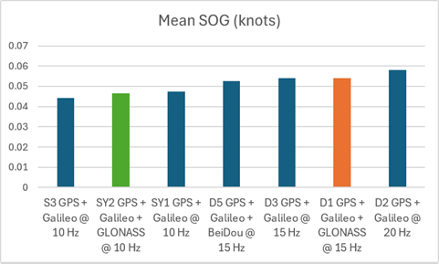
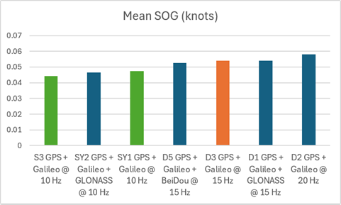
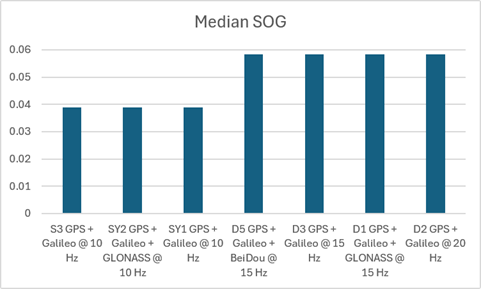
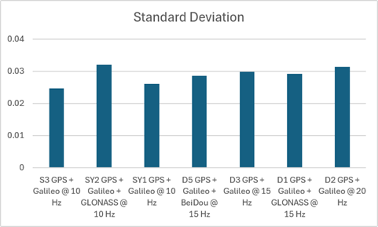

## Static ESP Testing - Phase 2

### Overview

The objective of phase 2 was to determine the relative performances of GLONASS and BeiDou B1C as a third GNSS. The SYRAC GPS devices were configured to use GPS + Galileo + GLONASS or GPS + Galileo + BeiDou B1C, and various sample rates - 10 Hz, 15 Hz, 20 Hz.

The tests were started on 2026-07-09 @ 1314 and the duration was more than 7.5 hours. The results showed that GPS + Galileo + BeiDou slightly outperformed GPS + Galileo + GLONASS, and 10 Hz consistently outperformed 15 Hz + 20 Hz

### Configurations

The following device configurations were tested, and the time distributions obtained from GPS Speedreader.

|   ID    | Constellations             | Rate  | Max Sats |   ESP   | Observed time distribution (ms)                      | Drops? |
| :-----: | -------------------------- | :---: | :------: | :-----: | :--------------------------------------------------- | :----: |
|   SY1   | GPS + Galileo              | 10 Hz |    32    | 160 MHz | 99: 2, 100: 273003, 101: 2, 200: 1                   |   Y    |
| **SY2** | GPS + Galileo + GLONASS    | 10 Hz |    32    | 160 MHz | 99: 19, 100: 270042, 101: 31, **199: 12, 200: 1406** |   Y    |
| **S3**  | **GPS + Galileo**          | 10 Hz |    32    | 160 MHz | 99: 7, 100: 272833, 101: 7                           |   -    |
|   D3    | GPS + Galileo              | 15 Hz |    32    | 240 MHz | 65: 1, 66: 1850, 67: 403800, 68: 1852                |   -    |
|   D1    | GPS + Galileo + GLONASS    | 15 Hz |    32    | 240 MHz | 66: 1869, 67: 410428, 68: 1875, 133: 6               |   Y    |
|   D5    | GPS + Galileo + BeiDou B1C | 15 Hz |    32    | 240 MHz | 65: 1, 66: 1864, 67: 410030, 68: 1870, 133: 4        |   Y    |
|   D2    | GPS + Galileo              | 20 Hz |    32    | 240 MHz | 50: 554566, 51: 8, 99: 8                             |   Y    |

Notes:

- S3 was intended to be GPS + Galileo + BeiDou B1C @ 10 Hz, but it somehow switched to GPS + Galileo
- SY2 dropped a lot of frames during this test, and the Python charts show clear issues with speed + sAcc
- Various time intervals were observed, due to the way the M10 handles clock drift

### Statistics

Click the GPY filenames for charts showing SOG, Sats, HDOP, and sAcc.

| File                 | Description                         | Mean  | Median | Stddev |
| -------------------- | ---------------------------------- | :---: | :----: | :----: |
| [S3\_\_2607091314.gpy](png/S3__2607091314.png) | GPS + Galileo @ 10 Hz            | 0.045 | 0.041  | 0.024  |
| [SY2\_2607091314.gpy](png/SY2_2607091314.png) | GPS + Galileo + GLONASS @ 10 Hz | 0.047 | 0.043  | 0.032  |
| [SY1\_\_2607091314.gpy](png/SY1__2607091314.png) | GPS + Galileo @ 10 Hz           | 0.048 | 0.045  | 0.026  |
| [D5\_2607091307.gpy](png/D5_2607091307.png) | GPS + Galileo + BeiDou @ 15 Hz   | 0.053 | 0.051  | 0.028  |
| [D3\_\_2607091314.gpy](png/D3__2607091314.png) | GPS + Galileo @ 15 Hz            | 0.054 | 0.051  | 0.030  |
| [D1\_2607091307.gpy](png/D1_2607091307.png) | GPS + Galileo + GLONASS @ 15 Hz  | 0.055 | 0.051  | 0.029  |
| [D2\_\_2607091307.gpy](png/D2__2607091307.png) | GPS + Galileo @ 20 Hz            | 0.059 | 0.054  | 0.031  |

GPS + Galileo + BeiDou (green) slightly outperformed GPS + Galileo + GLONASS (orange) @ 15 Hz.

10 Hz (green) consistently outperformed 15 Hz (orange), and 20 Hz (brown).

10 Hz (green) also outperformed 15 Hz (orange) and 20 Hz (brown) from the perspective of median values.

The standard deviation for SY2 was poor, but otherwise there seemed to be a trend that 10 Hz was better than 15 Hz and 20 Hz.

### Observations

- S3 was incorrectly configured
  - Shame because we cannot compare 10 Hz configurations
  - Will have to rely on phase 3 for comparing GLONASS vs B1C
- SY2 dropped lots of frames, and saw quite a few "mini spikes"
  - Perhaps due to the M10 using "balanced" [power mode](../../../../performance/signal-quality.md)
  - The clock may also be drifting quickly due to intervals of 101 ms
- Practically no difference between 15 Hz and 20 Hz
  - Arguably, 10 Hz was better

### Conclusions

- GPS + Galileo + BeiDou slightly outperformed GPS + Galileo + GLONASS
- 10 Hz consistently outperformed 15 Hz and 20 Hz

