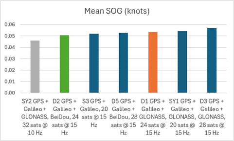
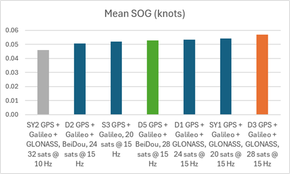
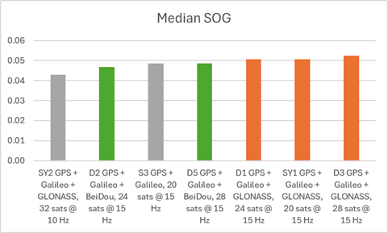
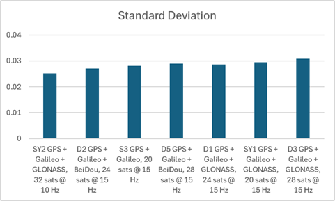

## Static ESP Testing - Phase 3

### Overview

The objective of phase 3 was to determine the effects of limiting the number of satellites @ 15 Hz. The SYRAC GPS devices were configured to use GPS + Galileo + GLONASS or GPS + Galileo + BeiDou B1C, and various satellite limits - 20, 24, and 28.

The tests were started on 2026-07-10 @ 2311 and the duration was close to 12 hours. The results re-enforced the belief that B1C is better than GLONASS, and also showed that satellites limits can prevent dropped frames, without reducing accuracy.

### Configurations

The following device configurations were tested.

|   ID    | Constellations             | Rate  | Max Sats |   ESP   | Observed time distribution (ms)                              | Drops? |
| :-----: | -------------------------- | :---: | :------: | :-----: | :----------------------------------------------------------- | :----: |
|   D3    | GPS + Galileo + GLONASS    | 15 Hz |    28    | 240 MHz | 65: 1, 66: 2844, 67: 623883, 68: 2855, 133: 9                |   Y    |
|   D5    | GPS + Galileo + BeiDou B1C | 15 Hz |    28    | 240 MHz | 66: 2838, 67: 623969, 68: 2842, 133: 4                       |   Y    |
|   D1    | GPS + Galileo + GLONASS    | 15 Hz |    24    | 240 MHz | 65: 1, 66: 2845, 67: 623816, 68: 2854, 132: 1, 133: 5        |   Y    |
|   D2    | GPS + Galileo + BeiDou B1C | 15 Hz |    24    | 240 MHz | 66: 2288, 67: 502609, 68: 2290, 133: 2                       |   Y    |
|   SY1   | GPS + Galileo + GLONASS    | 15 Hz |    20    | 240 MHz | 66: 2806, 67: 623919, 68: 2806                               |   -    |
| **S3**  | **GPS + Galileo**          | 15 Hz |    20    | 240 MHz | 66: 2835, 67: 623912, 68: 2835                               |   -    |
| **SY2** | GPS + Galileo + GLONASS    | 10 Hz |    32    | 160 MHz | 99: 21, 100: 417730, 101: 43, 199: 23, **200: 1987**, 201: 1 |   Y    |

Notes:

- S3 was intended to be GPS + Galileo + BeiDou B1C, but it somehow switched to GPS + Galileo
- All of the devices using more than 20 satellites dropped some frames, but SY2 dropped a LOT of frames

### Statistics

Click the GPY filenames for charts showing SOG, Sats, HDOP, and sAcc.

| File                 | Description                                  | Mean  | Median | Stddev |
| -------------------- | ----------------------------------- | :---: | :----: | :----: |
| [SY2\_2607102311.gpy](png/SY2_2607102311.png)  | GPS + Galileo + GLONASS, 32 sats @ 10 Hz | 0.046 | 0.043  | 0.025  |
| [D2\_\_2607102312.gpy.gpy](png/D2__2607102312.png)  | GPS + Galileo + BeiDou, 24 sats @ 15 Hz   | 0.051 | 0.047  | 0.027  |
| [S3\_\_2607102311.gpy](png/S3__2607102311.png)  | **GPS + Galileo, 20 sats @ 15 Hz**        | 0.052 | 0.049  | 0.028  |
| [D5\_2607102311.gpy](png/D5_2607102311.png)   | GPS + Galileo + BeiDou, 28 sats @ 15 Hz   | 0.053 | 0.049  | 0.029  |
| [D1\_2607102311.gpy](png/D1_2607102311.png)   | GPS + Galileo + GLONASS, 24 sats @ 15 Hz  | 0.053 | 0.051  | 0.028  |
| [SY1\_\_2607102311.gpy](png/SY1__2607102311.png) | GPS + Galileo + GLONASS, 20 sats @ 15 Hz | 0.054 | 0.051  | 0.029  |
| [D3\_\_2607102311.gpy](png/D3__2607102311.png)  | GPS + Galileo + GLONASS, 28 sats @ 15 Hz  | 0.057 | 0.052  | 0.031  |

GPS + Galileo + BeiDou (green) slightly outperformed GPS + Galileo + GLONASS (orange) with 24 satellites.

GPS + Galileo + BeiDou (green) slightly outperformed GPS + Galileo + GLONASS (orange) with 28 satellites.

GPS + Galileo + BeiDou (green) slightly outperformed GPS + Galileo + GLONASS (orange) @ 15 Hz from the perspective of median values.

The performances from the perspective of standard deviation were ordered in much the same way as the mean values.

### Observations

- S3 was intended to be GPS + Galileo + BeiDou B1C
  - Somehow it was switched to GPS + Galileo

- 38,400 baud was able to cope with a sample rate of 15 Hz
  - SY1 did not drop any frames, despite running at 38,400 baud

- All of the devices with more than 20 satellites dropped frames
  - SY2 dropped a LOT of frames, perhaps because max sats was 32

### Conclusions

- B1C is clearly better than GLONASS, certainly at this latitude
  - B1C outperformed GLONASS regardless of max sats = 24 or 28
  - Sadly no data for 20 sats, due to incorrect configuration on S3
- Reducing max sats does not necessarily reduce accuracy
  - 24 was the most accurate @ 15 Hz
  - 28 was the least accurate @ 15 Hz
- Reducing max sats can potentially prevent dropped frames
  - 20 had no dropped frames, but without any reduction in accuracy
