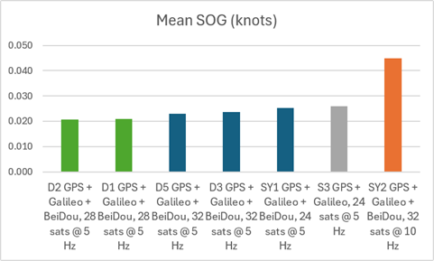
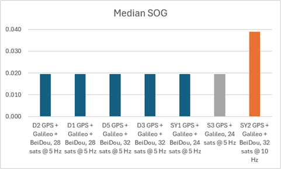
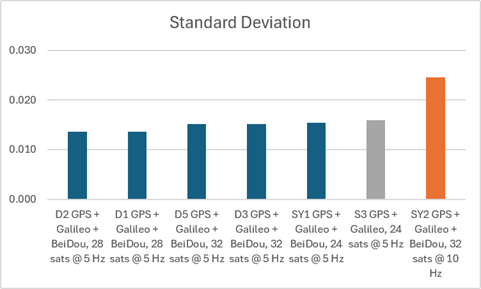

## Static ESP Testing - Phase 4

### Overview

Satellite limits @ 5 Hz

2026-07-10 @ 2311

### Configurations

The following device configurations were tested.

|  ID  | Constellations             | Rate  | Max Sats |   ESP   | Observed time distribution (ms)                      | Drops? |
| :--: | -------------------------- | :---: | :------: | :-----: | :--------------------------------------------------- | :----: |
|  S3  | **GPS + Galileo**          | 5 Hz  |    24    | 80 MHz  | 199: 2, 200: 94680, 201: 2                           |   -    |
|  D1  | GPS + Galileo + BeiDou B1C | 5 Hz  |    28    | 80 MHz  | 199: 13, 200: 183228, 201: 13, 400: 6                |   Y    |
|  D2  | GPS + Galileo + BeiDou B1C | 5 Hz  |    28    | 80 MHz  | 199: 5, 200: 183224, 201: 5, 400: 3                  |   Y    |
|  D3  | GPS + Galileo + BeiDou B1C | 5 Hz  |    32    | 80 MHz  | 199: 18, 200: 183737, 201: 18, 400: 5                |   Y    |
|  D5  | GPS + Galileo + BeiDou B1C | 5 Hz  |    32    | 80 MHz  | 199: 13, 200: 183253, 201: 13, 400: 8                |   Y    |
| SY2  | GPS + Galileo + BeiDou B1C | 10 Hz |    32    | 160 MHz | 99: 18, 100: 363251, 101: 38, **199: 20, 200: 2098** |   Y    |

S3 was intended to be GPS + Galileo + BeiDou B1C, but somehow reset itself to GPS + Galileo.

### Statistics

The following statistics were produced by a Python script, although it needed to use an SBP file instead of GPY.

| File                 | Configuration                      | Mean  | Median | Stddev |
| -------------------- | -------------------------------------------- | :---: | :----: | :----: |
| D2\_\_2607112346.sbp  | GPS + Galileo + BeiDou, 28 sats @ 5 Hz   | 0.021 | 0.019      | 0.014              |
| D1\_2607112346.sbp   | GPS + Galileo + BeiDou, 28 sats @ 5 Hz   | 0.021 | 0.019      | 0.014              |
| D5\_2607112346.sbp   | GPS + Galileo + BeiDou, 32 sats @ 5 Hz   | 0.023 | 0.019      | 0.015              |
| D3\_\_2607112345.sbp  | GPS + Galileo + BeiDou, 32 sats @ 5 Hz   | 0.024 | 0.019      | 0.015              |
| SY1\_\_2607112345.sbp | GPS + Galileo + BeiDou, 24 sats @ 5 Hz  | 0.025 | 0.019      | 0.015              |
| S3\_\_2607120443.sbp  | **GPS + Galileo, 24 sats @ 5 Hz**        | 0.026 | 0.019      | 0.016              |
| SY2\_2607112345.sbp  | GPS + Galileo + BeiDou, 32 sats @ 10 Hz | 0.045 | 0.039      | 0.025              |

### Charts

BLAH

BLAH

BLAH

### Results

Test 4

- Similar in nature to test 3, but 5 Hz and no GLONASS
- 5 Hz GGB with various sat limits
- S3 is incorrectly configured (GPS + Galileo) and should be ignored
- Max of 28 sats is optimal, but dropping frames
  - Rankings: 28 sats, 32 sats, 24 sats
- Results suggest that 10 Hz is much worse than 5 Hz for accuracy
  - SY2 (10 Hz) mean SOG is much worse than the 5 Hz devices
- HOWEVER this was D1 and D2 which performed best in test 3
  - Test 3 showed 24 sats was best, but also D1 and D2
