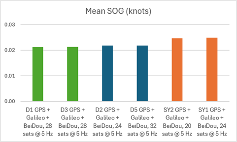
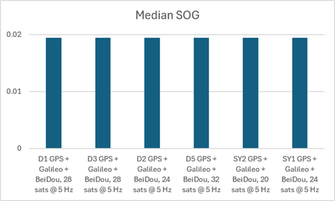
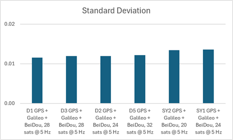

## Static ESP Testing - Phase 5

### Overview

Satellite limits @ 5 Hz

2026-07-11 @ 2345

### Configurations

The following device configurations were tested.

|   ID   | Constellations             | Rate | Max Sats |   ESP   | Observed time distribution (ms) | Drops? |
| :----: | -------------------------- | :--: | :------: | :-----: | :------------------------------ | :----: |
|  SY1   | GPS + Galileo + BeiDou B1C | 5 Hz |    24    | 160 MHz | 199: 3, 200: 157518, 201: 3     |   -    |
| **S3** | GPS + Galileo + BeiDou B1C | 5 Hz |    32    | 160 MHz | -                               |   -    |
|   D1   | GPS + Galileo + BeiDou B1C | 5 Hz |    28    | 160 MHz | 199: 10, 200: 156753, 201: 10   |   -    |
|   D2   | GPS + Galileo + BeiDou B1C | 5 Hz |    24    | 160 MHz | 199: 4, 200: 157173, 201: 4     |   -    |
|   D3   | GPS + Galileo + BeiDou B1C | 5 Hz |    28    | 160 MHz | 199: 16, 200: 157351, 201: 16   |   -    |
|   D5   | GPS + Galileo + BeiDou B1C | 5 Hz |    32    | 160 MHz | 199: 10, 200: 156891, 201: 10   |   -    |
|  SY2   | GPS + Galileo + BeiDou B1C | 5 Hz |    20    | 160 MHz | 199: 32, 200: 156725, 201: 32   |   -    |

Notes:

- S3 did not record any data during this test, presumably because the "start logging speed" was 1 knot
- None of the devices dropped frames, presumably because 5 Hz + 160 MHz is a good combination

### Charts

The Python charts are best viewed in new tabs... hold the ctrl key when left-clicking the links.

- [D1\_2607130203](png/D1_2607130203.png)
- [D2\_\_2607130201](png/D2__2607130201.png)
- [D3\_\_2607130201](png/D3__2607130201.png)
- [D5\_2607130202](png/D5_2607130202.png)
- [SY1\_\_2607130200](png/SY1__2607130200.png)
- [SY2\_2607130203](png/SY2_2607130203.png)

### Statistics

The following statistics were produced by a Python script, although it needed to use an SBP file instead of GPY.

| File                | Configuration                     | Mean  | Median | Stddev |
| ------------------- | ------------------------------------------- | :---: | :----: | :----: |
| D1\_2607130203.sbp   | GPS + Galileo + BeiDou, 28 sats @ 5 Hz  | 0.021 | 0.019      | 0.014              |
| D3\_\_2607130201.sbp  | GPS + Galileo + BeiDou, 28 sats @ 5 Hz  | 0.021 | 0.019      | 0.014              |
| D2\_\_2607130201.sbp  | GPS + Galileo + BeiDou, 24 sats @ 5 Hz  | 0.022 | 0.019      | 0.014              |
| D5\_2607130202.sbp   | GPS + Galileo + BeiDou, 32 sats @ 5 Hz | 0.022 | 0.019      | 0.014              |
| SY2\_2607130203.sbp  | GPS + Galileo + BeiDou, 20 sats @ 5 Hz | 0.025 | 0.019      | 0.015              |
| SY1\_\_2607130200.sbp | GPS + Galileo + BeiDou, 24 sats @ 5 Hz | 0.025 | 0.019      | 0.015              |

BLAH

BLAH

BLAH

### Results

Test 5

1. Still 5 Hz, but ESP back to 160 Mhz
2. S3 changed to GGB (currently GPS + GAL)
3. Sat limits re-allocated, so that devices that were previously paired are doing something different

This will determine several things:

1. Was the ESP clock causing dropped frames
2. Are D1 and D2 just more accurate than D3 and D5
3. What is the best configuration for D1 and D2 - 24 or 28 sats

Results

- Dropped frames are gone, presumably fixed by 160 MHz
- 28 sats was best, but 24 was pretty close
  - 24 sats had vastly differing results for D2 and SY1
    - D2 was good, SY1 was bad
  - 20 sats was worst, but that was SY2
    - Will assign 20 Hz to D5 as well for test 6
- Anecdotally, 5 Hz is in the same range as test 4 and MUCH better than 10 Hz

Also realised that the D models perform better than the S models
- went back and checked previous results to see if they were potentially impacted

WhatsApp

Test 5 summary... 28 sats came out on top for D1 + D3, slightly better than 24 sats (D2) and 32 sats (D5).
The D devices consistently perform better than the S devices across all of the tests. e.g. D2 vs SY1 in this test.
Test 6 factors explores this further with D5 and SY2 having 20 sats. Important for the next test to have the right settings. :)

Considerations

- Test 4 assigned 24 Hz to SY1 + S3 which may not be as good as D1 / D2 / D3 / D5
- Test 5 assigned 24 Hz to SY1 + D2 where it became clear D2 is better than SY1
  - SY2 was the only device running at 20 Hz
- Test 6 assigned 24 Hz to SY1 + D2 (like test 5)
  - SY2 + D5 were both running at 20 Hz

Learnings

- Some devices may be better than others
  - Need to do a single test with identical settings to establish which ones!
