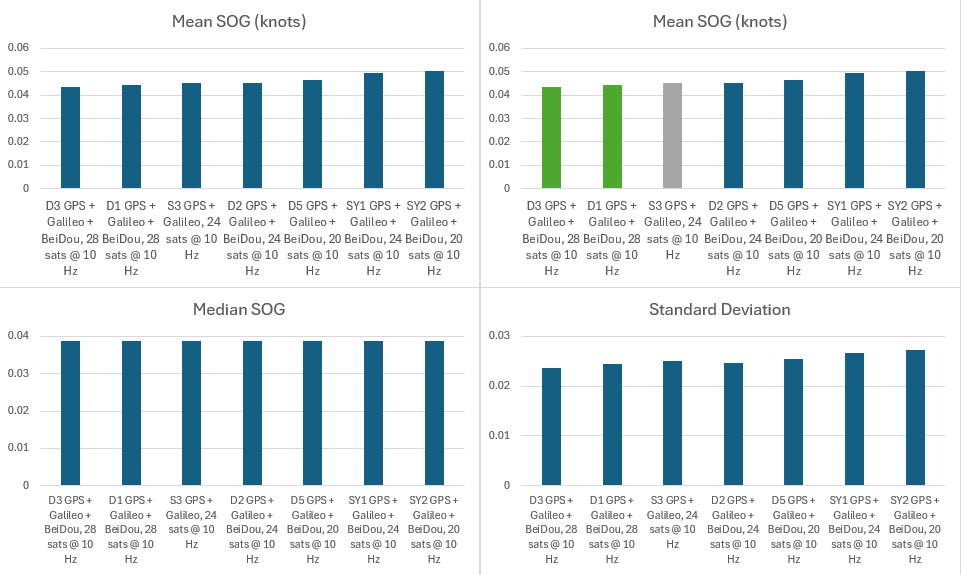

## Static ESP Testing - Phase 6

### Overview

Satellite limits @ 10 Hz

### Conclusions

### Configuration

|  ID  | Constellations             | Rate  | Max Sats |   ESP   |    Baud |
| :--: | -------------------------- | :---: | :------: | :-----: | ------: |
| SY1  | GPS + Galileo + BeiDou B1C | 10 Hz |    24    | 160 MHz |  38,400 |
|  S3  | **GPS + Galileo**          | 10 Hz |    24    | 160 MHz |  38,400 |
|  D1  | GPS + Galileo + BeiDou B1C | 10 Hz |    28    | 160 MHz | 115,200 |
|  D2  | GPS + Galileo + BeiDou B1C | 10 Hz |    24    | 160 MHz | 115,200 |
|  D3  | GPS + Galileo + BeiDou B1C | 10 Hz |    28    | 160 MHz | 115,200 |
|  D5  | GPS + Galileo + BeiDou B1C | 10 Hz |    20    | 160 MHz | 115,200 |
| SY2  | GPS + Galileo + BeiDou B1C | 10 Hz |    20    | 160 MHz |  38,400 |

S3 was intended to be GPS + Galileo + BeiDou B1C, but somehow reset itself to GPS + Galileo.

### Charts

### Results

Test 6 - 10 Hz tests

- S3 on wrong config
- SY2 could not handle GGB with 20 sats at 10 Hz
  - There is perhaps something wrong with the device
- Python stats are crucial and give different answer to distance alone
  - D3 and D1 best with 28 sats

Findings

1. Only SY2 dropped frames, but based on previous tests I can see it has often been struggling
2. The other 6 devices did not drop frames
3. just like 5 Hz, 28 sats was best