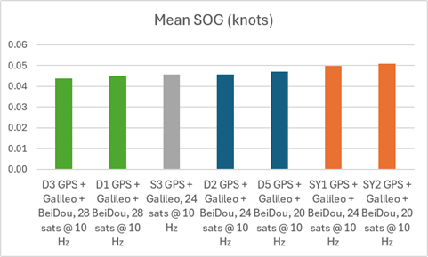
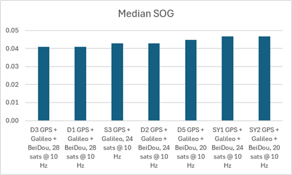
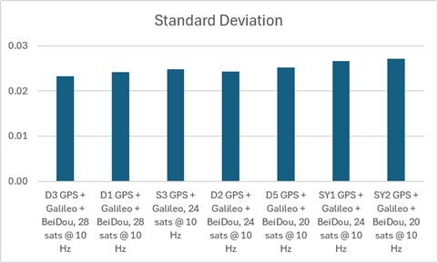

## Static ESP Testing - Phase 6

### Overview

The objective of phase 6 was to determine the effects of limiting the number of satellites @ 10 Hz. The SYRAC GPS devices were all intended to use GPS + Galileo + BeiDou B1C (no GLONASS), and various satellite limits - 20, 24, and 28.

The tests were started on 2026-07-13 @ 1348 and the duration was over 5 hours. The results showed max sats = 28 to be optimal @ 10 Hz, and 10 Hz to be less accurate than 5 Hz. There was also a hint that SY1 and SY2 have a slight performance disadvantage.

### Configurations

The following device configurations were tested.

|   ID    | Constellations             | Rate  | Max Sats |   ESP   | Observed time distribution (ms)                   | Drops? |
| :-----: | -------------------------- | :---: | :------: | :-----: | :------------------------------------------------ | :----: |
|   SY1   | GPS + Galileo + BeiDou B1C | 10 Hz |    24    | 160 MHz | 99: 1, 100: 190916, 101: 1                        |   -    |
| **S3**  | **GPS + Galileo**          | 10 Hz |    24    | 160 MHz | 99: 6, 100: 191198, 101: 6                        |   -    |
|   D1    | GPS + Galileo + BeiDou B1C | 10 Hz |    28    | 160 MHz | 99: 8, 100: 191205, 101: 8                        |   -    |
|   D2    | GPS + Galileo + BeiDou B1C | 10 Hz |    24    | 160 MHz | 99: 5, 100: 191132, 101: 5                        |   -    |
|   D3    | GPS + Galileo + BeiDou B1C | 10 Hz |    28    | 160 MHz | 99: 11, 100: 191851, 101: 11                      |   -    |
|   D5    | GPS + Galileo + BeiDou B1C | 10 Hz |    20    | 160 MHz | 99: 8, 100: 191009, 101: 8                        |   -    |
| **SY2** | GPS + Galileo + BeiDou B1C | 10 Hz |    20    | 160 MHz | 99: 19, 100: 190978, 101: 22, **199: 3, 200: 32** |   Y    |

Notes:

- S3 was intended to be GPS + Galileo + BeiDou B1C, but somehow switched to GPS + Galileo
- SY2 was the only device that dropped any frames. The Python charts show a clear issue in sAcc, only affecting SY2.

### Statistics

Click the SBP filenames for charts showing SOG, Sats, HDOP, and sAcc.

| File                  | Description                     | Mean  | Median | Stddev |
| --------------------- | ------------------------------- | :---: | :----: | :----: |
| [D3\_\_2607131348](png/D3__2607131348.png)  | GPS + Galileo + BeiDou, 28 sats @ 10 Hz  | 0.043 | 0.039      | 0.024              |
| [D1\_2607131349](png/D1_2607131349.png)   | GPS + Galileo + BeiDou, 28 sats @ 10 Hz  | 0.044 | 0.039      | 0.024              |
| [S3\_\_2607131349](png/S3__2607131349.png)  | **GPS + Galileo, 24 sats @ 10 Hz**       | 0.045 | 0.039      | 0.025              |
| [D2\_\_2607131349](png/D2__2607131349.png)  | GPS + Galileo + BeiDou, 24 sats @ 10 Hz  | 0.045 | 0.039      | 0.025              |
| [D5\_2607131349](png/D5_2607131349.png)   | GPS + Galileo + BeiDou, 20 sats @ 10 Hz  | 0.047 | 0.039      | 0.025              |
| [SY1\_\_2607131350](png/SY1__2607131350.png) | GPS + Galileo + BeiDou, 24 sats @ 10 Hz | 0.049 | 0.039      | 0.027              |
| [SY2\_2607131349.sbp](png/SY2_2607131349.png)  | GPS + Galileo + BeiDou, 20 sats @ 10 Hz | 0.050 | 0.039      | 0.027              |

28 satellites (green) performed best, but it is also noticeable that SY devices may not be as good as D devices.

The relative performances from the perspective of medians were much the same as the mean values.

The performances from the perspective of standard deviation were much the same as the mean values.

### Observations

- S3 was intended to be GPS + Galileo + BeiDou B1C
  - Somehow it was switched to GPS + Galileo
- 28 satellites performed best @ 10 Hz
  - The improvement over 20 and 24 is quite small
- SY devices did not perform as well as D devices
  - This will be factored into the plans for phase 7
- 24 sats had vastly differing results for D2 and SY1
  - D2 was good, SY1 was not so good
- 20 sats was worst, but that was SY2
  - Will assign 20 sats to D5 for phase 7
- SY2 dropped some frames, and saw quite a few "mini spikes"
  - Perhaps due to the M10 using "balanced" [power mode](../../../../performance/signal-quality.md)

### Conclusions

- Max of 28 sats provides the best accuracy @ 10 Hz
  - Order of accuracy @ 10 Hz is 28 sats, 24 sats, 20 sats
- The SY devices are not as accurate as the S devices
  - Phase 7 testing will take this into consideration