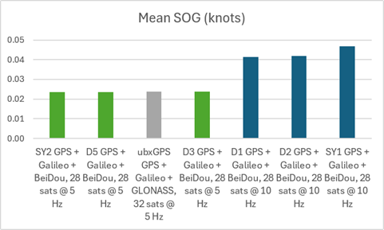
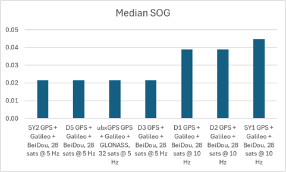
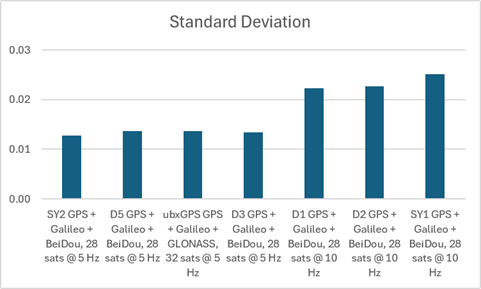
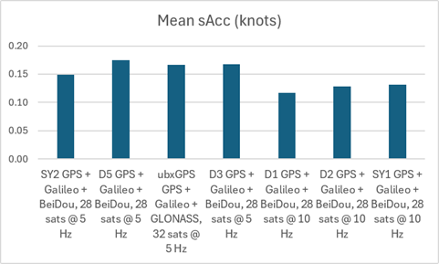
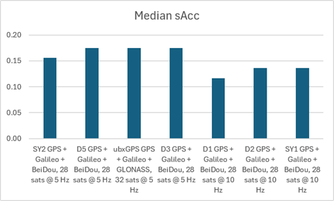
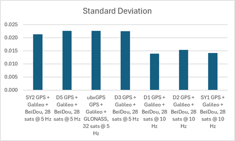

## Static ESP Testing - Phase 7

### Overview

Optimal 5 Hz vs 10 Hz

2026-07-14 @ 0031

### Configurations

The following device configurations were tested.

|  ID  | Constellations              | Rate  | Max Sats |    ESP     | Observed time distribution (ms)     | Drops? |
| :--: | --------------------------- | :---: | :------: | :--------: | :---------------------------------- | :----: |
|  D1  | GPS + Galileo + BeiDou B1C  | 10 Hz |    28    |  160 MHz   | 99: 11, 100: 338258, 101: 11        |   -    |
|  D2  | GPS + Galileo + BeiDou B1C  | 10 Hz |    28    |  160 MHz   | 99: 5, 100: 352086, 101: 5          |   -    |
|  D3  | GPS + Galileo + BeiDou B1C  | 5 Hz  |    28    |  160 MHz   | 199: 18, 200: 176100, 201: 18       |   -    |
|  D5  | GPS + Galileo + BeiDou B1C  | 5 Hz  |    28    |  160 MHz   | 199: 12, 200: 176461, 201: 12       |   -    |
|  S3  | **GPS + Galileo + GLONASS** | 5 Hz  |    32    | **80 Mhz** | 199: 4, 200: 176099, 201: 4, 400: 8 |   Y    |
| SY1  | GPS + Galileo + BeiDou B1C  | 10 Hz |    28    |  160 MHz   | 99: 3, 100: 351202, 101: 3          |   -    |
| SY2  | GPS + Galileo + BeiDou B1C  | 5 Hz  |    28    |  160 MHz   | 199: 36, 200: 175999, 201: 36       |   -    |

Notes:

- S3 was intended to be GPS + Galileo + BeiDou B1C @ 160 MHz, but somehow reset itself to GPS + Galileo + GLONASS @ 80 MHz

### Statistics

The following statistics were produced by a Python script, although it needed to use an SBP file instead of GPY.

| File                  | Description                             | Mean  | Median | Stddev |
| --------------------- | --------------------------------------- | :---: | :----: | :----: |
| SY2\_2607140033.sbp    | GPS + Galileo + BeiDou, 28 sats @ 5 Hz     | 0.023 | 0.019      | 0.015              |
| D5\_2607140031.sbp     | GPS + Galileo + BeiDou, 28 sats @ 5 Hz      | 0.024 | 0.019      | 0.015              |
| ubxGPS\_2607140032.sbp | **GPS + Galileo + GLONASS, 32 sats @ 5 Hz** | 0.024 | 0.019      | 0.015              |
| D3\_\_2607140033.sbp    | GPS + Galileo + BeiDou, 28 sats @ 5 Hz      | 0.024 | 0.019      | 0.015              |
| D1\_2607140032.sbp     | GPS + Galileo + BeiDou, 28 sats @ 10 Hz     | 0.041 | 0.039      | 0.023              |
| D2\_\_2607140033.sbp    | GPS + Galileo + BeiDou, 28 sats @ 10 Hz     | 0.042 | 0.039      | 0.023              |
| SY1\_\_2607140034.sbp   | GPS + Galileo + BeiDou, 28 sats @ 10 Hz    | 0.047 | 0.039      | 0.025              |

### Charts

BLAH

BLAH

BLAH

BLAH

BLAH

BLAH

### Results

Test 7

puts equally performing devices up against each other (e.g. D1 and D3) but 5 Hz vs 10 Hz

I have taken into consideration that S3 may use GGB (hopefully it will), and knowing that SY2 could not handle 10 Hz, put it on 5 Hz

Results

- 5 Hz significantly better than 10 Hz
  - There is no advantage to 10 Hz
- sAcc is misleading
  - It says that 10 Hz is performing better
- Performance of all 5 Hz devices comparable
  - SY1 performed less well than D1 and D2 @ 10 Hz, maybe baud rate?